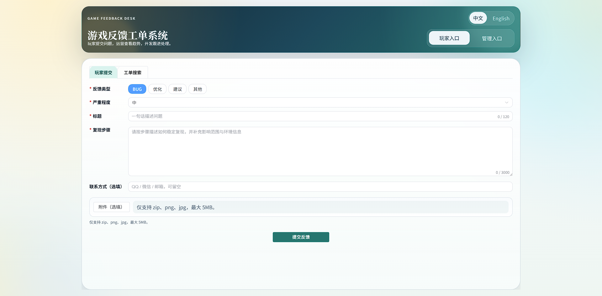
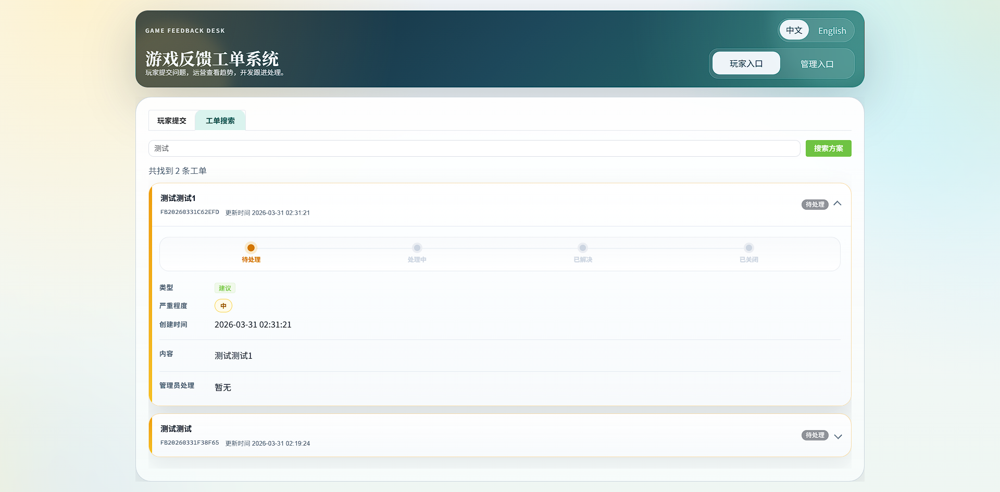
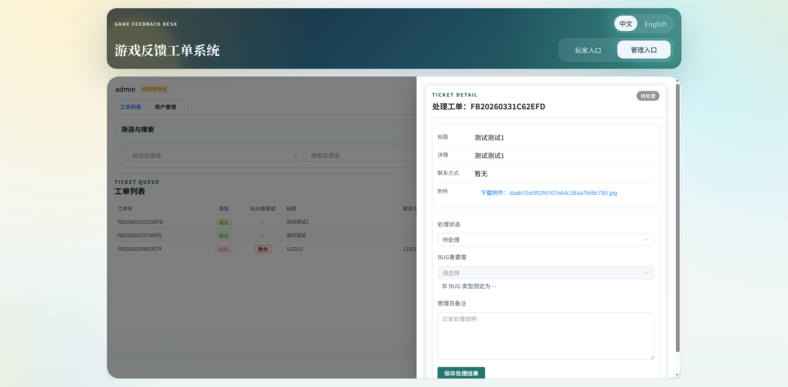

# feedbackForm

一个基于 Vue 3 + PHP + MySQL 的游戏反馈工单系统，支持玩家提交反馈、查询工单进度，以及管理员登录后台处理工单。

当前后端已调整为兼容 `PHP 7.2+`，数据库可使用 `MySQL 5.6+`。





## 项目简介

这个项目适合用来搭建一个轻量的游戏反馈入口，覆盖以下核心场景：

1. 玩家提交 `BUG`、`优化`、`建议`、`其他` 四类反馈。
2. 系统根据 `反馈类型 + 标题 + 详细介绍` 自动拦截重复提交。
3. 玩家可通过工单号查询当前处理状态和管理员备注。
4. 管理员可登录后台查看列表、筛选状态、处理工单。
5. 系统首次启动时可在页面内完成安装，自动建表并生成数据库配置文件。

## 目录结构

```text
feedbackForm/
├── web/                 # 前端（Vue 3 + Vite + Element Plus）
├── server/              # 后端（PHP + MySQL）
│   ├── public/          # HTTP 入口（仅启动与路由）
│   ├── src/             # 业务代码
│   │   ├── API/         # mod 分流后的接口模块
│   │   ├── Support/     # 请求、响应、数据库、Token 等基础能力
│   │   ├── Repository/  # 数据访问层
│   │   └── App.php      # 单入口路由分发
│   └── config/          # 配置文件
├── 需求文档.md
└── README.md
```

## 技术栈

- 前端：Vue 3、Vite、Element Plus
- 后端：PHP
- 数据库：MySQL
- 通信方式：前端 `fetch` 请求后端接口，开发环境通过 Vite 代理到 PHP 服务

## 功能清单

### 玩家侧

- 提交反馈工单
- BUG 类型可填写严重程度
- 命中重复反馈时直接返回已有工单号
- 根据工单号查询处理状态和管理员备注

### 管理侧

- 使用安装时设置的管理员密码登录
- 查看最新工单列表
- 按状态筛选工单
- 查看工单详情
- 更新工单状态与管理员备注

## 运行环境

开始前请先准备以下环境：

1. PHP 7.2 或更高版本
2. MySQL 5.6 或更高版本
3. Node.js 和 npm

## 快速开始

### 1. 克隆或进入项目目录

```bash
cd /path/to/feedbackForm
```

### 2. 先创建 MySQL 数据库

首次安装前，请先在 MySQL 中手动创建一个空数据库，例如：

```sql
CREATE DATABASE game_feedback DEFAULT CHARACTER SET utf8mb4;
```

注意：

- 系统会自动创建业务表
- 系统不会自动创建数据库本身

### 3. 启动后端服务

在项目根目录执行：

```bash
cd server/public
php -S 127.0.0.1:8000 router.php
```

启动后，后端入口地址为：

```text
http://127.0.0.1:8000/index.php
```

你也可以先访问健康检查接口确认服务正常：

```text
http://127.0.0.1:8000/index.php?s=system/Status/health
```

### 4. 启动前端服务

另开一个终端，在项目根目录执行：

```bash
cd web
npm install
npm run dev
```

启动后按终端提示打开前端地址，通常是：

```text
http://127.0.0.1:5173
```

开发环境下，前端会通过 Vite 代理把 `/api` 请求转发到：

```text
http://127.0.0.1:8000/index.php
```

## 首次安装教程

第一次打开前端页面时，如果系统还没有安装，会自动显示“首次安装”表单。

按下面步骤填写：

1. `数据库地址`：例如 `127.0.0.1`
2. `数据库端口`：默认 `3306`
3. `数据库名`：填写你提前创建好的数据库名，例如 `game_feedback`
4. `数据库用户`：例如 `root`
5. `数据库密码`：对应 MySQL 用户密码
6. `管理员密码`：用于后台登录，本地测试可留空

点击“立即安装”后，系统会自动完成这些事情：

1. 连接 MySQL
2. 创建 `feedback_tickets` 数据表
3. 在 `server/config/database.php` 生成数据库与上传相关配置

安装成功后，页面会自动切换到正常使用状态。

## 使用教程

### 玩家提交反馈

进入“玩家提交”标签页后：

1. 选择反馈类型：`BUG`、`优化`、`建议`
2. 如果是 `BUG`，还需要选择严重程度：`低`、`中`、`高`、`致命`
3. 填写标题
4. 填写详细介绍
5. 填写联系方式，例如 QQ、微信、邮箱
6. 点击“提交反馈”

补充说明：`BUG` 类型下，详细介绍建议尽量填写完整的复现步骤、出现频率和影响范围。

提交成功后，页面会提示一个工单号，例如：

```text
FB20260330A1B2C3
```

请保存这个工单号，后续查询进度时会用到。

如果提交内容与已有反馈重复，系统不会新建工单，而是直接返回已存在的工单号。

### 玩家查询工单

进入“工单查询”标签页后：

1. 输入工单号
2. 点击“查询”

页面会显示：

- 工单类型
- 严重程度
- 标题
- 详情
- 联系方式
- 当前状态
- 管理员备注
- 更新时间

### 管理员处理工单

进入“后台管理”标签页后：

1. 输入安装时设置的管理员密码
2. 点击“登录后台”
3. 登录成功后会自动加载工单列表
4. 可使用状态筛选查看指定状态的工单
5. 点击某一条工单可查看详情
6. 修改处理状态并填写管理员备注
7. 点击“保存处理结果”

当前支持的工单状态有：

- `待处理`
- `处理中`
- `已解决`
- `已关闭`

## 配置说明

### 后端配置

项目内置基础应用配置文件：

- `server/config/app.php`

其中定义了：

- 应用名称
- 时区
- 允许的反馈类型
- 允许的工单状态

安装完成后会额外生成：

- `server/config/database.php`

该文件包含：

- 数据库连接信息
- 上传模式（`upload_mode`）
- 附件大小上限（`upload_max_bytes`，单位：字节）
- 七牛云相关参数（当上传模式为 `qiniu` 时）

请不要把这个文件提交到公开仓库。

上传大小限制采用“后端配置统一下发”的方式：

1. 后端读取 `upload_max_bytes` 作为实际校验上限
2. `s=system/Status/installStatus` 返回 `uploadMaxBytes`
3. 前端使用 `uploadMaxBytes` 做选择文件时的大小校验与文案展示

如果你修改了 `upload_max_bytes`，建议同时确认网关层允许更大的请求体，例如 Nginx 的 `client_max_body_size` 应该大于或等于该值。

### 前端接口代理

开发环境代理配置位于：

- `web/vite.config.ts`

默认规则是：

- 前端访问 `/api`
- Vite 自动代理到 `http://127.0.0.1:8000/index.php`

如果你修改了后端端口或部署地址，需要同步调整这里的代理配置。

## 常见问题

### 1. 页面提示系统未安装

说明 `server/config/database.php` 还不存在，或者安装未成功完成。

可以检查：

1. MySQL 服务是否已启动
2. 数据库名是否已提前创建
3. 数据库账号密码是否正确
4. PHP 服务是否正常运行在 `127.0.0.1:8000`

### 2. 安装时报数据库连接失败

通常是以下原因之一：

1. 数据库地址、端口、用户名或密码填写错误
2. 数据库不存在
3. PHP 未启用 PDO / MySQL 相关扩展

### 3. 前端打开了，但请求接口失败

可以优先检查：

1. PHP 内置服务是否已经启动
2. 前端是否通过 `npm run dev` 启动
3. `web/vite.config.ts` 中代理地址是否正确

## 打包与部署

如果要部署前端静态资源，可执行：

```bash
cd web
npm install
npm run build
```

构建产物会输出到 `web/dist/`。

后端部署时建议：

1. 使用 Nginx 或 Apache 托管 PHP 服务
2. 为接口开启 HTTPS
3. 限制 `server/config/database.php` 的访问权限
4. 根据实际情况补充更完整的管理员鉴权、日志和审计能力

## 当前默认接口能力

后端当前已经实现以下接口：

- `s=system/Status/health`：健康检查
- `s=system/Status/installStatus`：安装状态检查（返回 `installed`、`uploadMode`、`uploadMaxBytes`）
- `s=system/Setup/enumOptions`：枚举选项
- `s=system/Setup/install`：首次安装
- `s=feedback/Ticket/submit`：提交反馈
- `s=feedback/Ticket/detail`：按工单号查询
- `s=feedback/Ticket/search`：公开方案搜索
- `s=admin/Auth/login`：管理员登录
- `s=admin/Auth/currentUser`：当前管理员信息
- `s=admin/Ticket/list`：管理员查看工单列表
- `s=admin/Ticket/detail`：管理员查看工单详情
- `s=admin/Ticket/attachmentDownload`：管理员下载附件
- `s=admin/Ticket/update`：管理员更新工单状态
- `s=admin/User/list`：管理员用户列表
- `s=admin/User/create`：创建管理员用户
- `s=admin/User/delete`：删除管理员用户
- `s=admin/User/resetPassword`：重置管理员密码

旧版 `action=xxx` 形式已移除。

## License

[MIT](./LICENSE)
